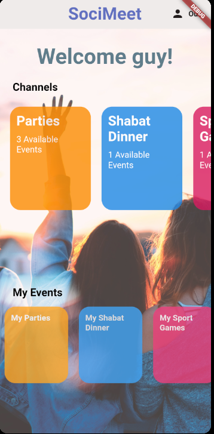

# Project Name
> Socimeet

## Table of contents
* [General info](#general-info)
* [Screenshots](#screenshots)
* [Technologies](#technologies)
* [Setup](#setup)
* [Features](#features)
* [Contact](#contact)

## General info
Socimeet is an app to make your social life easier.
You can use it to set up different kind of meetings with your friends or with people you have never met before.
During this time, we as a society, have a hard time connecting to new people and Sociemeet is a great platform to find this new connection, this new friend or even a group of friends which share the same interests as you! 

## Screenshots
### Welcome to Socimeet!  
 

 
### HomePage  
 
### General Parties Events  
 
### Events Info  
 
### Add OR update an event  
 

## Technologies
* Flutter - version 1.22.2
* Firebase - version 4.0.1
* Dart - version 2.10.2

## Setup
1) Clone this repository
2) Open android studio and set up your android emulator
3) Set flutter sdk path if needed
4) run pub get commend if needed
5) Run main.dart

## Features
List of features 
* Users can create their own events!
* Users can join to events created by different users
* Awesome feature 3

To-do list:
* Adding a rating system to each event so the creator of each event is rated
** By using the system we will add a functionality so highly rated users can open new channels  
* Show each user the his upcoming events on his Homepage
* Add a search engine to each channel, so a user can lookup events by different categories
* Add a friends list
* Add an invite property, so a user can invite other users on his contact list \ friends list to an event  

## Contact
Created by [@Yakir Zargon](https://github.com/yakirza12),[@Itamar Lederman](https://github.com/Itamarled),[@Shimi Nagar](https://github.com/Shimonna394)